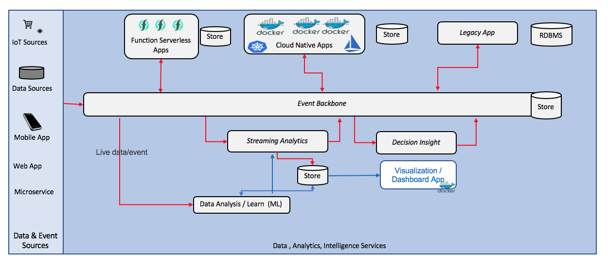

# Event Driven Architecture Reference Architecture
Today IT architectures are hybrid cloud and event driven: most businesses are using cloud deployment as part of their IT strategy and millions of events are created in this context. Adopting an event driven architecture brings loosely coupled components and simplify microservices integration.

This repository represents the root on related content about Event Driven Architecture and groups guidances and reusable assets for EDA.

## Table of Contents
* [Target Audiences](#target-audiences)
* [Summary](#summary)
* [Related repositories](#related-repositories)
* [Contribute to the solution](#contribute)
* [Project Status](#project-status)

## Target audiences
You will be greatly interested by the subjects addressed in this solution if you are...
* an architect, you will get a deeper understanding on how all the components work together, and how to address.
* a developer, you will get a broader view of the solution end to end and get existing starting code, and practices you may want to reuse during your future implementation. We focus on event driven solution in hybrid cloud addressing patterns and non functional requirements as CI/CD, Test Driven Development, resiliency, ...
* a project manager, you may understand all the artifacts to develop in an EDA solution, and we may help in the future to do project estimation.

## Summary
The high level component view can be summarized in the diagram below:  
  

* Data sources reference events coming from IoT device, mobile app, webapp, database triggers or microservices. Click stream from webapp or mobile app are common events used for real time analytics.
* The event backbone propagates events, which may be a hierarchy of messaging hub
* Consumer will be functions, traditional application and microservices. Microservices are also producer. As microservice persists its own data in its own store. 
* The bottom part of the diagram addresses real time streaming analytics supported by complex event processing runtime and analytics operations. There is also the opportunity to have data scientists connecting directly from a notebook to the topic and do real time data analysis, data cleansing and then train model on remote servers then deploy the model back to streaming analytics component...
* Business dashboards are also necessary and may be connected to event store or object store... pulling data on regular basis.
 
## Related repositories
* [Predictive maintenance - analytics and EDA](https://github.com/ibm-cloud-architecture/refarch-asset-analytics) how to mix Apache Kafka, stateful stream, Apache Cassandra and ICP for data to develop machine learning model deployed as a service.

## Compendium
* [Getting started with IBM Streams on IBM Cloud](https://console.bluemix.net/docs/services/StreamingAnalytics/t_starter_app_deploy.html#starterapps_deploy)
* [IBM Streams Samples](https://ibmstreams.github.io/samples/)
* [Kafka summary and deployment on IBM Cloud Private](https://github.com/ibm-cloud-architecture/refarch-analytics/tree/master/docs/kafka)
* [Service mesh](https://github.com/ibm-cloud-architecture/refarch-integration/blob/master/docs/service-mesh/readme.md)
* [Serverless](https://github.com/ibm-cloud-architecture/refarch-integration/tree/master/docs/serverless)
* [API for declaring messaging handlers using Reactive Streams](https://github.com/eclipse/microprofile-reactive-messaging/blob/master/spec/src/main/asciidoc/architecture.asciidoc)

## Contribute
We welcome your contribution. There are multiple ways to contribute: report bugs and improvement suggestion, improve documentation and contribute code.
We really value contributions and to maximize the impact of code contributions we request that any contributions follow these guidelines
* Please ensure you follow the coding standard and code formatting used throughout the existing code base
* All new features must be accompanied by associated tests
* Make sure all tests pass locally before submitting a pull request
* New pull requests should be created against the integration branch of the repository. This ensures new code is included in full stack integration tests before being merged into the master branch.
* One feature / bug fix / documentation update per pull request
* Include tests with every feature enhancement, improve tests with every bug fix
* One commit per pull request (squash your commits)
* Always pull the latest changes from upstream and rebase before creating pull request.

If you want to contribute, start by using git fork on this repository and then clone your own repository to your local workstation for development purpose. Add the up-stream repository to keep synchronized with the master.

## Project Status
[10/2018] Just started

## Contributors
* Lead development [Jerome Boyer](https://www.linkedin.com/in/jeromeboyer/)
Please [contact me](mailto:boyerje@us.ibm.com) for any questions.
