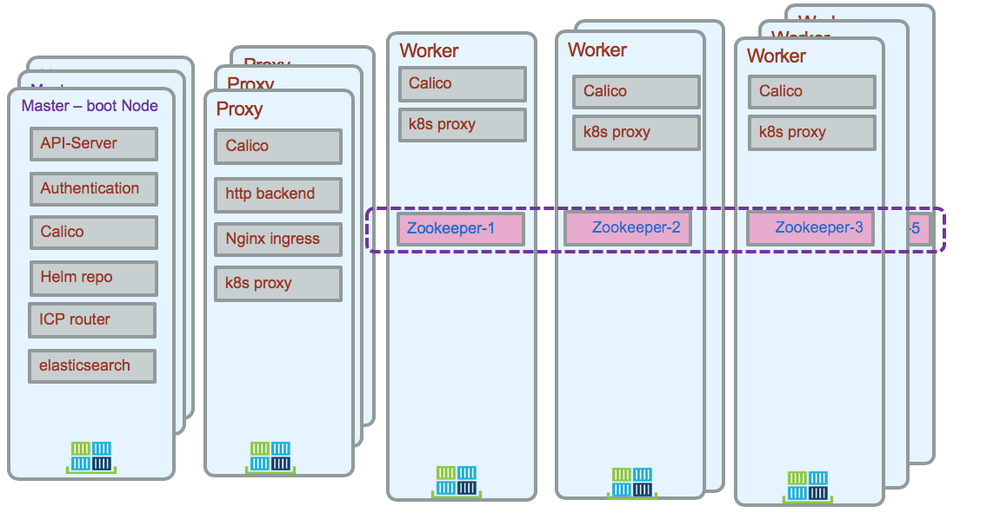

# Zookeeper Deployment

Development deployment uses one zookeeper server. For production the replicas is set to 5 to tolerate one planned and one unplanned failure. The service defines 3 ports: one for the inter-server communication, one for client access and one for leader-election.
Persistence volumes are needed to provide durable storage. Better to use network storage like NFS or glusterfs.

The zookeeper manifests are defined in this project under the `deployments/zookeeper/dev` folder. We are using our own docker images and the Dockerfile to build this image is in `deployments/zookeeper`. The image is already pushed to the Docker Hub under ibmcase account.

We are providing a script to install zookeeper as a kubernetes environment. First be sure to be connected to your kubernetes cluster then run the following command:
```
$ pwd
> refarch-eda/deployments/zookeeper
$ ./deployZoopeeker.sh

$ kubectl get pods -n greencompute
NAME                            READY     STATUS    RESTARTS   AGE
gc-zookeeper-57dc5679bb-bh29q   1/1       Running   0          1m
```

It creates volume, services and deployment or statefulset.

If you want to deploy it in more resilient deployment we provide other manifests under the prod folder. To install:
```
$ ./deployZoopeeker.sh prod
```

Once installed you do not need to reinstall it. The deployment on kubernetes may look like:




We are also delivering a script to remove zookeeper when you are done using it. (./removeZookeeper.sh)

 When running in production it is better to use separate zookeeper ensemble for each **Kafka** cluster. Each server should have at least 2 GiB of heap with at least 4 GiB of reserved memory
