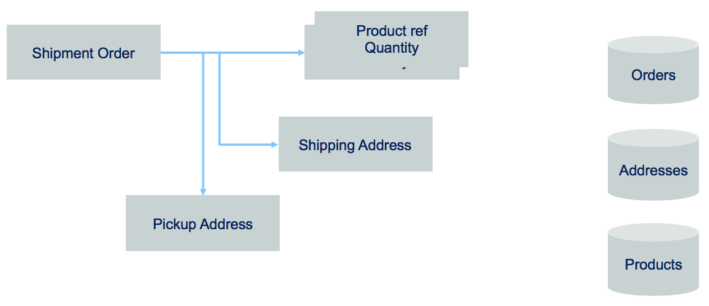
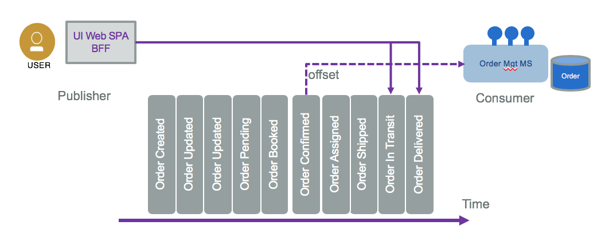
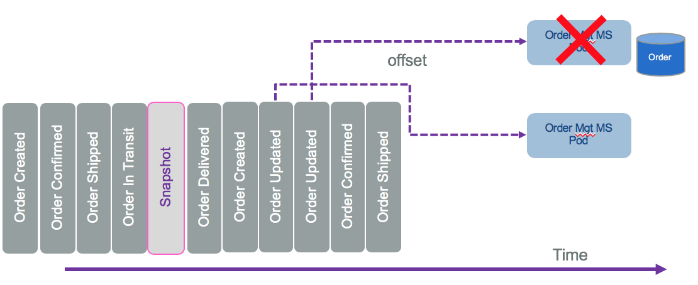
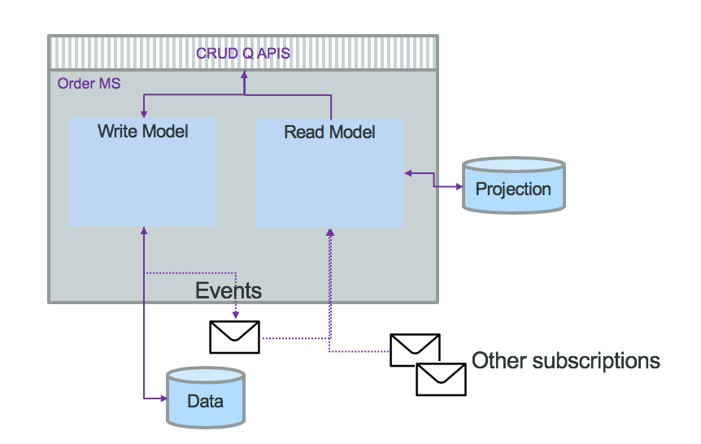
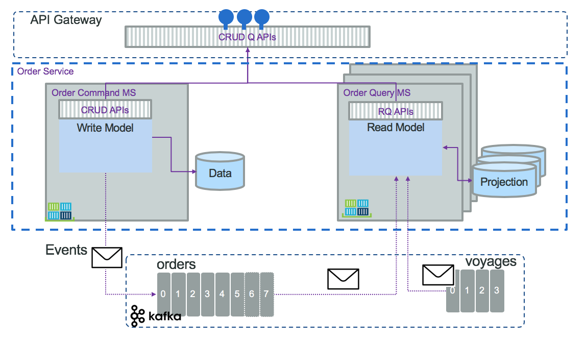

# Understanding event driven microservice patterns

Adopting messaging (Pub/Sub) as a microservice communication backbone involves using at least the following patterns:
* [Decompose by subdomain](https://microservices.io/patterns/decomposition/decompose-by-subdomain.html), event driven microservices are still microservices, so we need to find them, and the domain-driven subdomains is a good approach to identify and classify business function and therefore microservices. With the event storming method, aggregates help to find those subdomain of responsability. 
* [Database per service](https://microservices.io/patterns/data/database-per-service.html) to enforce each service persists data privatly and is accessible only via its API.
* [Saga pattern:](https://microservices.io/patterns/data/saga.html) Microservices publish events when something happens in the scope of their control like an update in the business entities they are responsible for. A microservice interested in other business entities, subscribe to those events and it can update its own states and business entities when recieving such events. Business entity keys needs to be unique, immutable. 
* [Event sourcing](#event-sourcing) persists the state of a business entity such an Order as a sequence of state-changing events.

* [Command Query Responsibility Segregation](#command-query-responsibility-segregation-cqrs-pattern) helps to separate queries from commands and help to address queries with cross-microservice boundary.

## Event sourcing

Most business applications are state based persistent where an update change the previous state of business entities. But there are business requirements that want to understand how a business reaches the current state.
Traditional domain oriented implementation builds domain data model mapped to a RDBMS. As an example, in the simple order model below the database record will keep the last state of the order and the last items in separate table.

   

 If you need implement a query that look at what happenned to the order over a time period, you need to change the model and add historical records, basically building a log table. Designing a service to manage the life cycle of this order will, most of the time, add a delete operation to remove data. But most businesses do not remove data.  For legal reason, a business ledger has to include a new record to compensate a previous transaction. There is no erasing of previously logged transaction. It is always possible to understand what was done in the past. Some business applications need to keep this capability.

**Event sourcing** persists the state of a business entity, such an Order, as a sequence of state-changing events. Applications or microservices can 

Historical records are immutable, and events represent facts of what happenned to the data. The previous order model changes to a time oriented immutable stream of events, organized by key:

   

 You can see the removing a product in the order is a new event. So now we can count how often products are removed. 
 
 With a central event logs, producer appends event to the log, and consumers read them from an **offset** (a last committed read). 

To get the final state of an entity, the consumer needs to replay all the events, which means replaying the changes to the state from the last committed offset or from the last snapshot. 

When replaying the event, it may be important to avoid generating side effects. A common side effect is to send a notification on state change to consumers. Sometime it may be too long to replay hundreds of events. In that case we can use snapshot, to capture the current state of an entity, and then replay events from the most recent snapshot. This is an optimization technique not needed for all event sourcing implementations. When state change events are in low volume there is no need for snapshots.

Kafka is supporting the event sourcing pattern with [the topic and partition](../kafka/readme.md).

The event sourcing pattern is well described in [this article on microservices.io](https://microservices.io/patterns/data/event-sourcing.html). It is a very important pattern for EDA and for microservices to microservices data synchronization implementations.

See also this nice [event sourcing article](https://martinfowler.com/eaaDev/EventSourcing.html) from Martin Fowler, where he is also using ship movement example. [Our implementation]() differs as we are using Kafka topic as event store and use the Order business entity.

Another use case for event sourcing is related to developers who want to understand what data to fix after a service crashes, for example after having deployed a buggy code.

### Command sourcing

Command sourcing is a similar pattern as the event sourcing one, but the commands that modify the states are persisted instead of the events. This allows commands to be processed asynchronously, which can be relevant when the command execution takes a lot of time.
One derived challenge is that the command may be executed multiple times, specially in case of failure. Therefore, it has to be idempotent. Finally, there is a need also to perform validation of the command to avoid keeping wrong commands in queue. For example, AddItem command is becoming AddItemValidated, then once persisted to a database it becomes ItemAdded. 

* Business transactions are not ACID and span multiple services, they are more a series of steps, each step is supported by a microservice responsible to update its own entities. We talk about eventual consistency of the data.
* The event backbone needs to guarantee that events are delivered at least once and the microservices are responsible to manage their offset from the stream source and deal with inconsistency, by detecting duplicate events.
* At the microservice level, updating data and emitting event needs to be an atomic operation, to avoid inconsistency if the service crashes after the update to the datasource and before emitting the event. This can be done with an eventTable added to the microservice datasource and an event publisher that reads this table on a regular basis and change the state of the event once published. Another solution is to have a database transaction log reader or miner responsible to publish event on new row added to the log.
* One other approach to avoid the two phase commit and inconsistency is to use an Event Store or Event Sourcing pattern to keep trace of what is done on the business entity with enough data to rebuild the data. Events are becoming facts describing state changes done on the business entity.

## Command Query Responsibility Segregation (CQRS) pattern

When doing event sourcing and domain driven design, we event source the aggregates or root entities. Aggregate creates events that are persisted. On top of the simple create, update and read by ID operation, the business requirements want to perform complext queries that can't be answered by a single aggregate. By just using event sourcing to be able to respond to a query like what are the orders of a customer, then we have to rebuild the history of all orders and filter per customer. It is a lot of computation. This is linked to the problem of having conflicting domain model between query and persistence.  
Command Query Responsibility Segregation, CQRS, separates the read from the write model. The following figure presents the high level principles:

The service exposes CUD operations, some basic Read by Id and then queries APIs. The domain model is splitted into write and read models. Combined with Event Sourcing the `write model` goes to the event store. Then we have a separate process that consumes those events and build a projection for future queries. The "write" part may persist in SQL while the read may use document oriented database with strong indexing and query capabilities. They do not need to be in the same language. With CQRS amd ES the projections are retroactives. New query equals implementing new projection and read the events from the beginning of time or the recent snapshot. Read and write models are strongly decoupled and can evolve independently. It is important to note that the Command part can still handle simple queries, primary-key based, like get order by id, or queries that do not involve joins.

With this structure, the `Read model` microservice will most likely consume events from multiple topics to build the data projection based on joining those data. A query, to assess if the cold-chain was respected on the fresh food order shipment, will go to the voyage, container metrics, and order to be able to answer this question. This is in this case that CQRS shines.

A second view of the previous diagram presents how we can separate the API definition and management in a API gateway, the Order command and write model as its own microservice, the event sourcing supported by a Kafka topic, and the query - read model as microservices or event function as a service:

The [shipment order microservice](https://github.com/ibm-cloud-architecture/refarch-kc-order-ms) is implementing this pattern. 

Some items to consider: 

* **Consistency** (ensure the data constraints are respected for each data transaction): CQRS without event sourcing has the same consistency guarantees as the database used to persist data and events. With Event Sourcing the consistency could be different, one for the "Write" model and one for the "Read" model. On write model strong consistency is important to ensure the current state of the system is correct, so it leverages transaction, lock and sharding. On read side, we need less consistency, as they mostly work on stale data. Locking data on the read operation is not reasonable. 
* **Scalability**: Separating read and write as two different microservices allows for high availability. Caching at the "read" level can be used to increase scalabilty. It is also possible to separate query between different services or functions.
* **Availability**: As the "write" model is often strongly consistent, it impacts availability. This is a fact. The read model is eventually consistent so high availability is possible. In case of failure the system disables the writing of data but still be able to read them as they are served by different databases and services. 

With CQRS the "write" model can evolve overtime without impacting the read model, unless the event model changes. It adds some cost by adding more tables to implement the query parts. It allows smaller model, easier to understand. 

CQRS results in an increased number of objects, with commands, operations, events,... and packaging in deployable component or container. It adds potentially different type of data sources. It clearly states of the eventually consistent data. 

Some challenges to always consider: 
* how to support event version management
* assess the size of the event history to keep and add data duplication which results to synchronization issues. 

The CQRS pattern was introduced by [Greg Young](https://www.youtube.com/watch?v=JHGkaShoyNs), https://martinfowler.com/bliki/CQRS.html https://microservices.io/patterns/data/cqrs.html

As soon as we see two arrows from the same component we have to ask ourselves how does it work: the write model has to persist Order in its own database and then send OrderCreated event to the topic... Should those operations be atomic and controlled with transaction?

### The consistency challenge

As introduced in previous section there is potentially a problem of data consistency: the command part saves the data into the database and is not able to send the event to the topic, then consumers do not see the new or updated data.  
With traditional Java service, using JPA and JMS, the save and send operations can be part of the same transaction and both succeed or both failed.
With even sourcing pattern, the source of trust is the event source. It acts as a version control system. So the service should start by creating the event (1) and then to persist the data into the database, it uses a consumer filtering on create or update order event (2). It derives state solely from the events. If it fails to save, it can persist to an error log the order id (4) and then it will be possible to trigger the replay via an admin API (5,6) using a search in the topic the OrderCreated event with this order id to replay the save operation. Here is a diagram to illustrate that process:

This implementation brings a problem on the createOrder(order): order operation, as the returned order was supposed to have the order id as unique key, so most likely, a key created by the database... To avoid this we can generate the key by code and enforce this key in the database if it supports it. 

There are other ways to support this dual operations level:

* There is the open source [Debezium tool](https://debezium.io/) to help respond to insert, update and delete operations on database and generate event accordingly. It may not work on all database schema. 
* Write the order to the database and in the same transaction write to a event table. Then use a polling to get the event to send to kafka from this event and delete it in the table once sent. 
* Use the Capture Data Change from the database transaction log and generate events from this log. The IBM [Infosphere CDC](https://www.ibm.com/support/knowledgecenter/cs/SSTRGZ_10.2.0/com.ibm.cdcdoc.mcadminguide.doc/concepts/overview_of_cdc.html) product helps to achieve that.

What is important to note is that the event needs to be flexible on the data payload. We are presenting a [event model](https://github.com/ibm-cloud-architecture/refarch-kc-order-ms#data-and-event-model) in the reference implementation.

On the view side, updates to the view part need to be indempotent. 

### Delay in the view

There is a delay between the data persistence and the availability of the data in the Read model. For most business applications it is perfectly acceptable. In web based data access most of the data are at stale. 

When there is a need for the client, calling the query operation, to know if the data is up-to-date, the service can define a versioning strategy. When the order data was entered in a form within a single page application like our [kc- ui](https://github.com/ibm-cloud-architecture/refarch-kc-ui), the create order operation should return the order with the id created and the SPA will have the last data.

### Schema change

What to do when we need to add attribute to event?. So we need to create a versioninig schema for event structure. You need to use flexible schema like json schema, [Apache Avro](https://avro.apache.org/docs/current/) or [protocol buffer](https://developers.google.com/protocol-buffers/) and may be and event adapter (as a function?) to translate between the different event structures.

## Code References

* The K Containers shipment use cases provides a supporting EDA example  https://github.com/ibm-cloud-architecture/refarch-kc
* Within K Containers shipment the following are example microservices illustrating some of those patterns  
  * https://github.com/ibm-cloud-architecture/refarch-kc-ms
  * https://github.com/ibm-cloud-architecture/refarch-kc-order-ms

  

