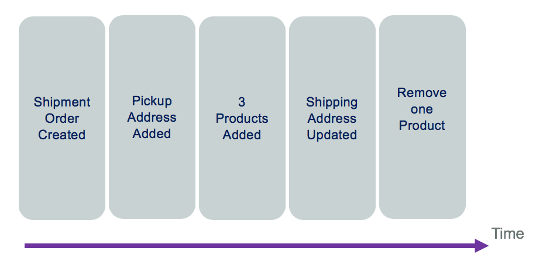
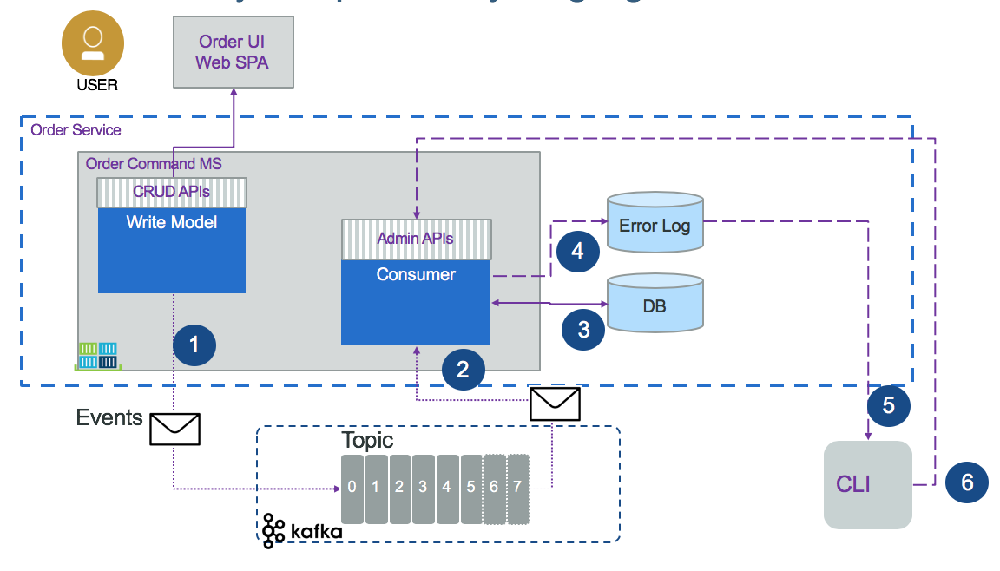
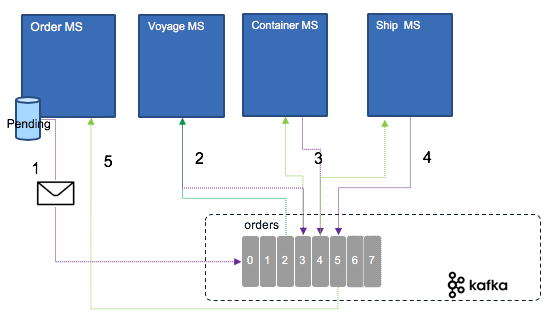
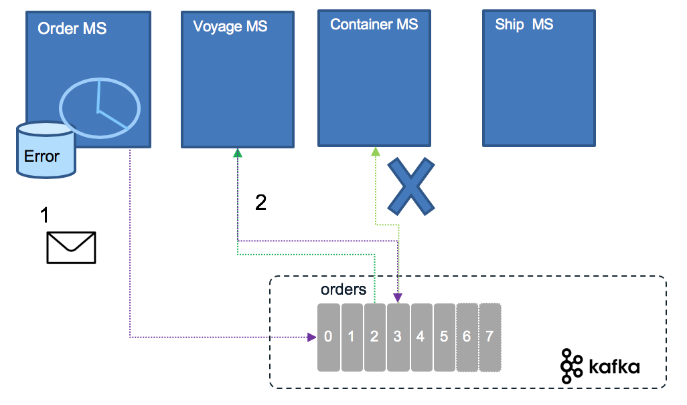
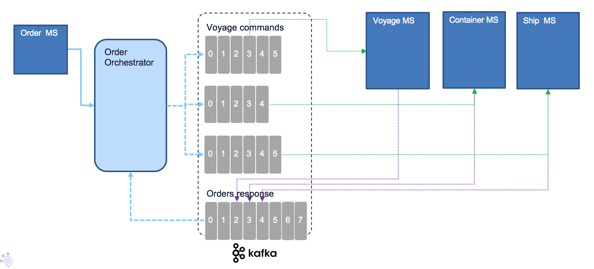

# Understanding event driven microservice patterns

!!! abstract
    In this article, we are detailing some of the most import event-driven patterns to be used during your microservice implementation and when adopting kafka as an event backbone.

Adopting messaging (Pub/Sub) as a microservice communication backbone involves using at least the following patterns:

* [Decompose by subdomain](https://microservices.io/patterns/decomposition/decompose-by-subdomain.html), event driven microservices are still microservices, so we need to find them, and the domain-driven subdomains is a good approach to identify and classify business function and therefore microservices. With the event storming method, aggregates help to find those subdomain of responsibility. 
* [Database per service](https://microservices.io/patterns/data/database-per-service.html) to enforce each service persists data privately and is accessible only via its API. Services are loosely coupled limiting impact to other service when database schema changes. The database technology is selected from business requirements. The implementation of transactions that span multiple services is complex and enforce using the Saga pattern. Queries that goes over multiple entities is a challenge and CQRS represents an interesting solution. 
* [Strangler pattern](#strangler-pattern) is used to incrementally migrate an existing, monolytic application by replacing a set of features to a microservice but keep both running in parallel. 
* [Saga pattern:](#saga-pattern) Microservices publish events when something happens in the scope of their control like an update in the business entities they are responsible for. A microservice interested in other business entities, subscribe to those events and it can update its own states and business entities when receiving such events. Business entity keys needs to be unique, immutable. 
* [Event sourcing](#event-sourcing) persists the state of a business entity such an Order as a sequence of state-changing events. 
* [Command Query Responsibility Segregation](#command-query-responsibility-segregation-cqrs-pattern) helps to separate queries from commands and help to address queries with cross-microservice boundary.


Update 06/2019 - *Author: [Jerome Boyer](https://www.linkedin.com/in/jeromeboyer/)*  

## Event sourcing

Most business applications are state based persistent where any update changes the previous state of business entities. The database keeps the last committed update. But some business application needs to **explain how it reaches its current state**. For that the application needs to keep history of business facts. 
Traditional domain oriented implementation builds a domain data model and map it to a RDBMS. As an example, in the simple `Order model` below, the database record will keep the last state of the order, the different addresses and the last ordered items in separate tables.

   

If you need to implement a query that looks at what happened to the order over a time period, you need to change the model and add historical records, basically building a log table. Designing a service to manage the life cycle of this order will, most of the time, add a "delete operation" to remove data.  For legal reason, most businesses do not remove data. As an example, a business ledger has to include new record(s) to compensate a previous transaction. There is no erasing of previously logged transactions. It is always possible to understand what was done in the past. Most business application needs to keep this capability.

**Event sourcing** persists the state of a business entity, such an Order, as a sequence of state-changing events or "facts" ordered over time. When the state of a system changes, an application issues a notification event of the state change. Any interested parties can become consumers of the event and take required actions.  The state-change event is immutable stored in an event log or event store in time order.  The event log or store becomes the principal source of truth. The system state can be recreated from a point in time by reprocessing the events. The history of state changes becomes an audit record for the business and is often a useful source of data for business analysts to gain insights into the business.

The previous order model changes to a time oriented immutable stream of events, organized by the orderID key:

   

You can see the "removing an item" in the order is a new event. With this capability, we can count how often a specific product is removed. 
 
In some cases, the event sourcing pattern is implemented completely within the event backbone.  Kafka topic and partitions are the building blocks for event sourcing. However, you can also consider implementing the pattern with an external event store, which provides optimizations for how the data may be accessed and used. For example [IBM Db2 Event store](https://www.ibm.com/products/db2-event-store) can provide the handlers and event store connected to the backbone and can provide optimization for down stream analytical processing of the data.

An event store needs to store only three pieces of information:

* The type of event or aggregate.
* The sequence number of the event.
* The data as a serialized entity.

More data can be added to help with diagnosis and audit, but the core functionality only requires a narrow set of fields. This gives rise to a very simple data design that can be heavily optimized for appending and retrieving sequences of records.

With a central event logs, producers append events to the log, and consumers read them from an **offset** (the last committed read). 


To get the final state of an entity, the consumer needs to replay all the events, which means replaying the changes to the state from the last committed offset or from the last snapshot or the origin of "time". 

When replaying the event, it may be important to avoid generating side effects. A common side effect is to send a notification on state change to other consumers. So the consumer of events need to be adapted to the query and business requirement. For example if the code needs to answer to the question: "what happened to the order over time for order ID = 75?" then there is no side effect, only a report can be created each time the consumer runs.

Sometime it may be too long to replay hundreds of events. In that case we can use snapshot, to capture the current state of an entity, and then replay events from the most recent snapshot. This is an optimization technique not needed for all event sourcing implementations. When state change events are in low volume there is no need for snapshots. 

Kafka is supporting the event sourcing pattern with [the topic and partition](../kafka/readme.md). In our [reference implementation](https://ibm-cloud-architecture.github.io/refarch-kc) we are validating event sourcing with Kafka in the [Order microservices](https://github.com/ibm-cloud-architecture/refarch-kc-order-ms) and specially [this set of test cases.](https://ibm-cloud-architecture.github.io/refarch-kc/itg-tests/#how-to-proof-the-event-sourcing)

The event sourcing pattern is well described in [this article on microservices.io](https://microservices.io/patterns/data/event-sourcing.html). It is a very important pattern to support eventual data consistency between microservices and for data synchronization between system as the event store becomes the source of truth.

See also this [event sourcing article](https://martinfowler.com/eaaDev/EventSourcing.html) from Martin Fowler, where he is also using ship movement examples. [Our implementation](https://github.com/ibm-cloud-architecture/refarch-kc) differs as we are using Kafka topic as event store and use different entities to support the container shipping process: the Orders, ShipLocations, Containers entities...

Another common use case, where event sourcing helps, is when developers push a new code version that corrupts the data: being able to see what was done on the data, and being able to reload from a previous state helps fixing problems. 

### Command sourcing

Command sourcing is a similar pattern as the event sourcing one, but the commands that modify the states are persisted instead of the events. This allows commands to be processed asynchronously, which can be relevant when the command execution takes a lot of time.
One derived challenge is that the command may be executed multiple times, especially in case of failure. Therefore, it has to be idempotent ( making multiple identical requests has the same effect as making a single request). Finally, there is a need also to perform validation of the command to avoid keeping wrong commands in queue. For example, `AddItem` command is becoming `AddItemValidated`, then once persisted to a database it becomes an event as `ItemAdded`. So mixing command and event sourcing is a common practice.

* Business transactions are not ACID and span multiple services, they are more a serie of steps, each step is supported by a microservice responsible to update its own entity. We talk about "eventual data consistency".
* The event backbone needs to guarantee that events are delivered at least once and the microservices are responsible to manage their offset from the stream source and deal with inconsistency, by detecting duplicate events.
* At the microservice level, updating data and emitting event needs to be an atomic operation, to avoid inconsistency if the service crashes after the update to the datasource and before emitting the event. This can be done with an eventTable added to the microservice datasource and an event publisher that reads this table on a regular basis and change the state of the event once published. Another solution is to have a database transaction log reader or miner responsible to publish event on new row added to the log.
* One other approach to avoid the two-phase commit and inconsistency is to use an Event Store or Event Sourcing pattern to keep track of what is done on the business entity with enough information to rebuild the data state. Events are becoming facts describing state changes done on the business entity.

## Command Query Responsibility Segregation (CQRS) pattern

When doing event sourcing and domain driven design, we event source the aggregates or root entities. Aggregate creates events that are persisted. On top of the simple create, update and read by ID operations, the business requirements want to perform complex queries that can't be answered by a single aggregate. By just using event sourcing to be able to respond to a query like "what are the orders of a customer", then we have to rebuild the history of all orders and filter per customer. It is a lot of computation. This is linked to the problem of having conflicting domain models between query and persistence.  
Command Query Responsibility Segregation, CQRS, separates the "command" operations, used to update application state (also named the 'write model'), from the "query/read" operations (the 'read model').  Updates are done as state notification events (change of state), and are persisted in the event log/store. On the "read model" side, you have the option of persisting the state in different stores optimized for how other applications may query/read the data.

The CQRS application pattern is frequently associated with event sourcing.

The following figure presents the high level principles:


The service exposes CUD operations, some basic Read by Id and then queries APIs. The domain model is separated into write and read models. Combined with Event Sourcing (ES) the `write model` goes to the event store. Then we have a separate process that consumes those events and build a projection for future queries. The "write" part may persist in SQL while the read may use document oriented database with strong indexing and query capabilities. Or use in-memory database. They do not need to be in the same language. With CQRS and ES the projections are retroactive. New query equals implementing new projection and read the events from the beginning of time or the recent snapshot. Read and write models are strongly decoupled and can evolve independently. It is important to note that the 'Command' part can still handle simple queries, primary-key based, like get order by id, or queries that do not involve joins.

With this structure, the `Read model` microservice will most likely consume events from multiple topics to build the data projection based on joining those data. A query, to assess if the cold-chain was respected on the fresh food order shipment, will go to the voyage, container metrics, and order to be able to answer this question. This is where CQRS shines.

A second view of the previous diagram presents how we can separate the API definition and management in a API gateway, the Order command and write model has its own microservice, the event sourcing supported by a Kafka topic, and the query - read model as a set of different microservices or event functions as a service:


The [shipment order microservice](https://github.com/ibm-cloud-architecture/refarch-kc-order-ms) is implementing this pattern. 

Some implementation items to consider: 

* **Consistency** (ensure the data constraints are respected for each data transaction): CQRS without event sourcing has the same consistency guarantees as the database used to persist data and events. With Event Sourcing the consistency could be different, one for the "Write" model and one for the "Read" model. On write model strong consistency is important to ensure the current state of the system is correct, so it leverages transaction, lock and sharding. On read side, we need less consistency, as they mostly work on stale data. Locking data on the read operation is not reasonable. 
* **Scalability**: Separating read and write as two different microservices allows for high availability. Caching at the "read" level can be used to increase performance response time, and can be deployed as multiple standalane instances (Pods in kubernetes). It is also possible to separate the query implementations between different services. Functions as service / serverless are good technology choices to implement complex queries. 
* **Availability**: As the "write" model is often strongly consistent, it impacts availability. This is a fact. The read model is eventually consistent so high availability is possible. In case of failure the system disables the writing of data but still be able to read them as they are served by different databases and services. 

With CQRS the "write" model can evolve overtime without impacting the read model, unless the event model changes. It adds some cost by adding more tables to implement the query parts. It allows smaller model, easier to understand. 

CQRS results in an increased number of objects, with commands, operations, events,... and packaging in deployable components or containers. It adds potentially different type of data sources. It is more complex. 

Some challenges to always consider: 

* How to support event version management?
* How much data to keep in the event store (history)?
* Design data duplication which results to synchronization issues. 

The CQRS pattern was introduced by [Greg Young](https://www.youtube.com/watch?v=JHGkaShoyNs), and described in [Martin Fowler's work on microservices.](https://martinfowler.com/bliki/CQRS.html)

As soon as we see two arrows from the same component we have to ask ourselves how does it work: the write model has to persist Order in its own database and then sends OrderCreated event to the topic... Should those operations be atomic and controlled with transaction? We are detailing this in next section.

### The consistency challenge

As introduced in previous section there is potentially a problem of data consistency: the command part saves the data into the database and is not able to send the event to the topic, then consumers do not see the new or updated data.  
With traditional Java service, using JPA and JMS, the save and send operations can be part of the same transaction and both succeed or both failed.  
With event sourcing pattern, the source of trust is the event source. It acts as a version control system. So the service should start by creating the event (1) and then persists the data into the database, it uses a topic consumer, get the payload from the event (2) and uses this data to save in its local datasource (3). It derives state solely from the events. If it fails to save, it can persist the event to an error log (4) and then it will be possible to trigger the replay, via an admin API and Command Line Interface (5,6), by searching in the topic using this order id to replay the save operation. Here is a diagram to illustrate that process:



This implementation brings a problem on the `createOrder(order): order` operation, as the returned order was supposed to have the order id as unique key, so most likely, a key created by the database... To avoid this we can generate the key by code and enforce this key in the database if the underlying technology supports it. 

It is important to clearly study the Kafka consumer API and the different parameters on how to support the read offset. We are addressing those implementation best practices in [our consumer note.](../kafka/consumers.md)

### CQRS and Change Data Capture

There are other ways to support this dual operations level:

* There is the open source [Debezium tool](https://debezium.io/) to help respond to insert, update and delete operations on database and generate event accordingly. It may not work on all database schema. 
* Write the order to the database and in the same transaction write to an event table. Then use a polling to get the events to send to kafka from this event table and delete the row in the table once the event is sent. 
* Use the Change Data Capture from the database transaction log and generate events from this log. The IBM [Infosphere CDC](https://www.ibm.com/support/knowledgecenter/cs/SSTRGZ_10.2.0/com.ibm.cdcdoc.mcadminguide.doc/concepts/overview_of_cdc.html) product helps to implement this pattern. For more detail about this solution see [this product tour](https://www.ibm.com/cloud/garage/dte/producttour/ibm-infosphere-data-replication-product-tour).

The CQRS implementation using CDC will look like in the following diagram:


What is important to note is that the event needs to be flexible on the data payload. We are presenting a [event model](https://github.com/ibm-cloud-architecture/refarch-kc-order-ms#data-and-event-model) in the reference implementation.

On the view side, updates to the view part need to be idempotent. 

### Delay in the view

There is a delay between the data persistence and the availability of the data in the Read model. For most business applications, it is perfectly acceptable. In web based data access most of the data are at stale. 

When there is a need for the client, calling the query operation, to know if the data is up-to-date, the service can define a versioning strategy. When the order data was entered in a form within a single page application like our [kc- user interface](https://github.com/ibm-cloud-architecture/refarch-kc-ui), the "create order" operation should return the order with its unique key freshly created and the Single Page Application will have the last data. Here is an example of such operation:

```java
@POST
public Response create(OrderCreate dto) {
    Order order = new Order(UUID.randomUUID().toString(), dto.getProductID(),...);
    // ...
    return Response.ok().entity(order).build()
}
```

### Schema change

What to do when we need to add attribute to event?. So we need to create a versioninig schema for event structure. You need to use flexible schema like json schema, [Apache Avro](https://avro.apache.org/docs/current/) or [protocol buffer](https://developers.google.com/protocol-buffers/) and may be, add an event adapter (as a function?) to translate between the different event structures. 

<ToBeCompleted>

## Saga pattern

With the adoption of one data source per microservice, there is an interesting challenge on how to support long running transaction cross microservices. With event backbone two phase commit is not an option. Introduced in 1987 [by Hector Garcaa-Molrna Kenneth Salem paper](https://www.cs.cornell.edu/andru/cs711/2002fa/reading/sagas.pdf) the Saga pattern help to support a long running transaction that can be broken up to a collection of sub transactions that can be interleaved any way with other transactions. 

With microservice each transaction updates data within a single service, each subsequent steps may be triggered by previous completion. The following figure, based on [our solution implementation](https://ibm-cloud-architecture.github.io/refarch-kc), illustrates those concepts for an order:


When the order is created, it can be updated at any time by the user until he/she books it as the final order. As soon as the order is booked, the process needs to allocate the voyage, assigns containers and updates the list of containers to load on the ship. Those actions / commands are chained. The final state (in this schema not in the reality as the process has more steps) is the Order assigned state in the order microservice.

SAGA pattern supports two types of implementation: Choreography and Orchestration. 

### Services choreography

With Choreography each service produces and listens to other service’s events and decides if an action should be taken or not.



The first service executes a transaction and then publishes an event. It maintains the business entity status, (order.status) to the pending state until it is completed. This event is listened by one or more services which execute local transactions and publish new events.
The distributed transaction ends when the last service executes its local transaction or when a service does not publish any events or the event published is not polled by any of the saga’s participants.

In case of failure, the source microservice is keeping state and timer to monitor for the completion event.



Rolling back a distributed transaction does not come for free. Normally you have to implement another operation/transaction to compensate for what has been done before. This will be a new event sent by the service responsible of the transaction integrity.

### Services orchestration

With orchestration, one service is responsible to drive each participant on what to do and when.



If anything fails, the orchestrator is also responsible for coordinating the rollback by sending commands to each participant to undo the previous operation.
Orchestrator is a State Machine where each transformation corresponds to a command or message.
Rollbacks are a lot easier when you have an orchestrator to coordinate everything.

See also [this article](https://microservices.io/patterns/data/saga.html) from Chris Richardson on the Saga pattern.

## Strangler pattern

### Problem

How to migrate a monolytics application to microservice without doing a big bang, redeveloping the application from white page. Replacing and rewritting an existing application can be a huge investment. Rewritting a subset of business functions while running current application in parallel may be relevant and reduce risk and velocity of changes. 

### Solution

The approach is to use a "strangler" interface to dispatch request to new or old features. Existing features to migrate are selected by trying to isolate sub components. 

One of main challenge is to isolate data store and how the new microservices and the legacy application are accessing the shared data. Continuous data replication can be a solution to propagate write model to read model. Write model will most likely stays on the monolitic application, change data capture can be used, with event backbone to propagate change to read model.

The facade needs to be scalable and not a single point of failure. It needs to support new APIs (RESTful) and old API (most likely SOAP).

## Code References

* The K Containers shipment use cases provides a supporting EDA example [https://github.com/ibm-cloud-architecture/refarch-kc](ttps://github.com/ibm-cloud-architecture/refarch-kc)
* Within K Containers shipment the following are example microservices illustrating some of those patterns  
    * [https://github.com/ibm-cloud-architecture/refarch-kc-ms](https://github.com/ibm-cloud-architecture/refarch-kc-ms)
    * [https://github.com/ibm-cloud-architecture/refarch-kc-order-ms](https://github.com/ibm-cloud-architecture/refarch-kc-order-ms)


  

