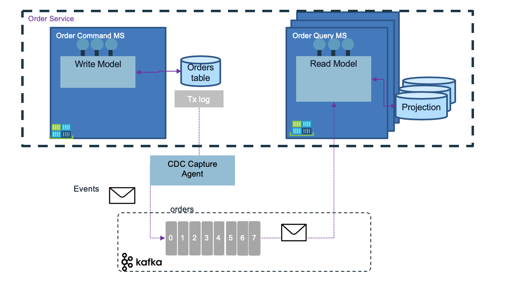

# Data replication

STILL UNDER CONSTRUCTION

!!! abstract
    In this article, we are dealing with database replication to a microservice environment. This is also known as coexistence use case and can be summarized as supporting the following requirements:

* Keep a RDBMS database like DB2 on the mainframe where transactions are supported
* Add cloud native applications in kubernetes environment, with a need to read data coming from the legacy DB, without impacting the DB server with a lot of new queries
* Address writing model, where cloud native apps have to write back to legacy DB
* Replicate data in real time to data lake or cloud based data store.
* Replicated data is for multiple consumers

There are a lot of products which are addressing those requirements, but here we address the integration with Kafka for a pub/sub and event store need.

The following diagram may illustrate what we want to build:

## Change data capture (CDC)

At the high level we want to get an event stream for any change to data or schema of a database table, and propagated those changes for others to consume. 

The use cases are for data replication between database and continuous propagate changes in real time instead of doing it by batch with traditional ETL product. But it can also be used to feed analytics system and data warehouses.

Other use cases are related to auditing anfd historical query on what happened on specific records. Using event sourcing, delivered out of the box with kafka, this will be easier to support. It can be used to propagate data changes to remote caches and invalidate them, to projection view in CQRS microservices, populate full text search in Elasticsearch, Apache Solr...

## Why adopting kafka for data replication

Using Kafka as a mediation layer bring the following advantages:

* Offload Processing
* Aggregation of Data From multiple Sources
* Common Platform for Staging to Other Data Consumers
* Storage System For Duplicating Important Data
* Buffer Unprocessed Messages
* Offers Throughput and Low End-to-End Latency 
* Offers Real Time Processing and Retrospective Analysis
* Can Correlate Streaming Feeds of Disparate formats
* Can Correlate Streaming Feeds of Disparate formats
* Flexibility of Input Source and Output Targets
* Built in Stream Processing on Real Time Feeds
* Flexibility Supporting Business Logic Layering Or Programmatic * Interpretation
* Commit Log
* Statistics
* Red Flag Monitoring
* Fault Tolerance, Scalability, multi-tenant nature, speedy, light-weight, landing-zone

## IBM Data Replication (CDC)

IBM's InfoSphere Data Replication (IIDR) captures and replicates data, and changes made to the data, on relational source systems and delivers those changes to other environments and applications that need them in a trusted and guaranteed fashion, ensuring referential integrity and synchronization between sources and targets.

The basic architecture of a deployed solution looks like in the diagram below:

With the management console, developer can define data replication project, that can includes one to many subscriptions. Subscription defines the source database and tables and target kafka cluster and topics.  

The first time a subscription is running, a Refresh is performed: to allow the source and target to be exactly synchronized before the incremental, changes only get replicated down to the target. This means all the records in the source table will be written as Kafka events. 

When running subscription the first time, kafka topics are added: one to hold the records from the source table, and the second to keep track of which records have already been committed to the target. 

For more detail about this solution see [this product tour](https://www.ibm.com/cloud/garage/dte/producttour/ibm-infosphere-data-replication-product-tour).

## Debezium

[Debezium](https://debezium.io/) is an open source distributed platform for change data capture. It retrieves change events from transaction logs from different databases and use kafka as backbone, and kafka connect.
It uses the approach of one table to one topic. 

It can be used to do data synchronization between microservices using CDC at one service level and propagate changes via kafka. The implementation of the CQRS pattern may be simplified with this capability. 

## Kafka connect

[Kafka connect](https://kafka.apache.org/documentation/#connect) simplifies the integration between kafka and other systems. It helps to standardize the integration via connector and configuration file. It is a distributed fault tolerant runtime to be able to easily scale horizontally. The set of connectors help developers reinvent the wheel.

To get started read [this introduction](https://kafka.apache.org/documentation/#connec) from product documentation. 

The kafka connect workers are stateless and can run easily on kubernetes or as standalone docker process. `Kafka Connect Source` is to get data to kafka, and `Kafka Connect Sink` to get data out of kafka.

A worker is a process. A connector is a re-usable piece of java code packaged as jars, and configuration. Both elements are defined a task. A connector can have multiple tasks. 

With distributed deployment the connector cluster supports easy scaling by adding new worker and performs rebalancing of worker tasks in case of worker failure. The configuration can be sent dynamically to the cluster via REST api.

!!! note  
    We are providing a special implementation of the container management service using kafka connect. 

## Recommended Readings

* [IBM InfoSphere Data Replication Product Tour](https://www.ibm.com/cloud/garage/dte/producttour/ibm-infosphere-data-replication-product-tour)
* [Kafka connect hands-on learning from Stéphane Maarek](https://learning.oreilly.com/videos/apache-kafka-series)